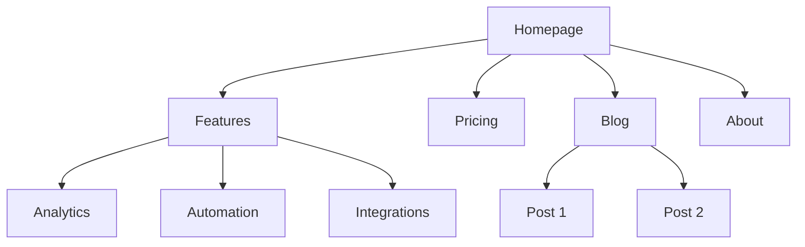
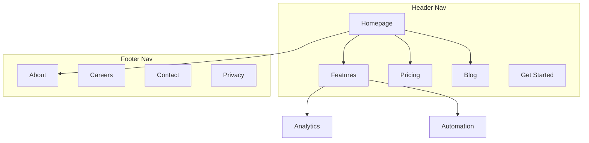

# Visual Sitemap Output (Mermaid)

Use Mermaid `graph TD` for visual sitemaps. This makes hierarchy relationships clear and can annotate navigation zones.

## Basic Hierarchy

## With Navigation Zones

